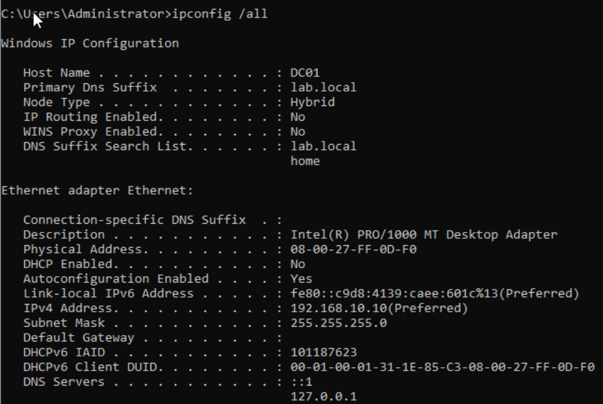

# 🏢 Enterprise Active Directory Lab

**Simulated Corporate Environment – Northbridge Solutions Inc.**

---

## 📌 Project Overview

This project simulates a structured Windows Server domain environment designed to demonstrate practical Level 1 and Level 2 IT Support skills.

The lab models:

* Organizational Unit (OU) design
* User account lifecycle management
* Security group implementation (AGDLP)
* Client domain join
* DNS troubleshooting
* Account lockout and password scenarios

---

# 🏗️ Lab Environment Architecture

**Domain:** lab.local
**Domain Controller:** DC01
**Client Machine:** CLIENT01
**Network Type:** Internal Network (VirtualBox)
**DNS:** Hosted on Domain Controller

| System   | Role                     | IP Address                    |
| -------- | ------------------------ | ----------------------------- |
| DC01     | Domain Controller + DNS  | 192.168.10.10                 |
| CLIENT01 | Windows 10 Domain Client | Configured to use DC01 as DNS |

---

# 🧩 Business Scenario

Company: **Northbridge Solutions Inc.**

Departments simulated:

* DevDept
* ExecDept

Each department contains:

* Dedicated OU structure
* Security groups
* Department users
* Controlled access to shared resources

This mirrors enterprise directory design.

---

# 🔐 Active Directory Structure

## Organizational Unit Design

```
lab.local
│
├── DevDept
│   ├── Users
│   └── Computers
│
├── ExecDept
│   ├── Users
│   └── Computers
```
## DevTeam OU Structure


### Note:

* Enables targeted Group Policy
* Organizes users logically
* Simplifies onboarding/offboarding
* Prevents administrative clutter

---

# 👤 User Lifecycle Management

Practiced tasks:

- **Create users** – [View Screenshot](screenshots/create-user.png)
- **Reset passwords** – [View Screenshot](screenshots/reset-password.png)
- **Unlock locked accounts** – [View Screenshot](screenshots/unlock-account.png)
- **Force password change at next logon** – [View Screenshot](screenshots/force-password-change.png)
- **Disable accounts** – [View Screenshot](screenshots/disable-account.png)
- **Re-enable accounts** – [View Screenshot](screenshots/reenable-account.png)
- **Move users between OUs** – [View Screenshot](screenshots/move-user-ou.png)
- **Add users to security groups** – [View Screenshot](screenshots/add-user-group.png)

### Help Desk Scenarios Simulated

| Scenario            | Resolution                                      |
| ------------------- | ----------------------------------------------- |
| User locked out     | Unlock account in ADUC                          |
| Password expired    | Reset password and force change                 |
| Employee terminated | Disable account                                 |
| Department transfer | Move user to new OU and update group membership |

---

# 🛡️ Security Group Strategy (AGDLP Model)

Implemented Microsoft best practice:

**Accounts → Global Groups → Domain Local Groups → Permissions**

### Example

```
User (JDavis)
   ↓
GG_DevTeam_Users (Global)
   ↓
DL_DevShare_RW (Domain Local)
   ↓
NTFS Permissions on Shared Folder
```

### Why This Matters

* Prevents direct user-to-resource permissions
* Keeps ACLs clean
* Simplifies access changes
* Reflects enterprise security standards

---

# 💻 Client Deployment & Domain Join

Tasks completed:

* Installed Windows 10 on CLIENT01
* Configured networking to communicate with DC01
* Verified connectivity using:
  * ping
  * ipconfig
* Corrected DNS misconfiguration
* Joined CLIENT01 to lab.local domain
* Logged in using domain user account
* Verified authentication

---

# 🌐 DNS & Network Troubleshooting

Configured DC01 as DNS server.

Validated:

* Client DNS points to 192.168.10.10
* Domain resolution works
* Login failures traced to DNS misconfiguration
* Resolved “Destination Host Unreachable” error

## DC01 DNS Configuration



Note:

*Active Directory depends entirely on correct DNS configuration.
*Validates the Client 01 points to DNS Server
*Authenicate User and process Group policies
*If DNS is wrong, everything is wrong

---

# 📊 Skills Demonstrated

## Directory Services

* Active Directory Users & Computers
* OU Design
* User provisioning
* Group membership management
* Security group strategy (AGDLP)
* NTFS permission assignment

## Desktop Support

* Windows 10 installation
* Domain join process
* DNS troubleshooting
* Network validation
* Account lockout resolution
* Password management

## Troubleshooting Methodology

* Validate network first
* Confirm DNS configuration
* Verify authentication path
* Apply structured root-cause approach

---

# 🎯 Job Relevance

This lab demonstrates practical experience in:

* Level 1 Help Desk operations
* Level 2 Active Directory support
* Domain client onboarding
* Account lifecycle management
* Enterprise troubleshooting workflow

---

# 📸 Screenshots

Stored in `/screenshots` directory:

* OU Structure
* Security Group configuration
* AGDLP example
* Client domain join
* DNS configuration
* Account lockout resolution

---

# 🚀 Next Planned Enhancements

* Implement Group Policy Objects (GPO)
* Add file share permissions scenario
* Introduce basic PowerShell automation
* Integrate ticketing system simulation

---


Your next lab move depends on that decision.
